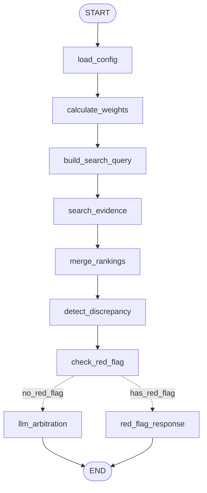

# OrthoCare

> 근거 기반 근골격계 진단 및 운동 추천 AI 시스템 (V3 - 마이크로서비스 아키텍처)
>
> 현재 지원 부위: **무릎**, **어깨**

---

## 목차

1. [프로젝트 개요](#1-프로젝트-개요)
2. [V3 아키텍처](#2-v3-아키텍처---마이크로서비스-분리)
3. [프로젝트 구조](#3-프로젝트-구조)
4. [파이프라인 상세](#4-파이프라인-상세)
5. [데이터 구조](#5-데이터-구조)
6. [운동 데이터베이스 스키마 및 추천 알고리즘](#6-운동-데이터베이스-스키마-및-추천-알고리즘)
7. [API 엔드포인트](#7-api-엔드포인트-상세)
8. [사후 평가 시스템](#8-사후-평가-시스템-rpe-기반)
9. [설치 및 실행](#9-설치-및-실행)
10. [평가 결과](#10-평가-결과)
11. [기술 스택](#11-기술-스택)

---

## 1. 프로젝트 개요

OrthoCare는 자연어 증상 입력을 분석하여 근골격계 통증의 원인을 진단하고, 의학 논문 근거에 기반한 맞춤형 운동 프로그램을 추천하는 AI 시스템입니다.

### 핵심 기능

- **Config-Driven Architecture**: 부위별(무릎/어깨) 설정 파일로 동일 파이프라인, 다른 진단 로직 구현
- **3-Layer 근거 검색**: 검증된 논문 → OrthoBullets → PubMed 순으로 신뢰도 높은 근거 우선 제공
- **버킷 기반 진단**: 부위별 4가지 카테고리로 통증 분류 (무릎: INF, 어깨: STF)
- **Anti-Hallucination**: LLM이 실제 검색된 문서만 인용 (가짜 논문 인용 방지)
- **맞춤형 운동 추천**: 진단 결과와 신체 상태에 따른 운동 프로그램 생성
- **사후 평가 반영**: RPE 기반 피드백으로 다음 세션 난이도 자동 조정

### 버킷 분류 체계

#### 무릎 (Knee)

| 버킷 | 의미 | 주요 특징 | 예시 |
|------|------|----------|------|
| **OA** | Osteoarthritis (퇴행성) | 만성, 진행성, 아침 뻣뻣함 <30분 | 골관절염, 연골 마모 |
| **OVR** | Overuse (과사용) | 활동 후 악화, 반복적 동작 | 러너스니, 슬개대퇴 증후군 |
| **TRM** | Trauma (외상) | 급성 발병, 외상 이력 | ACL 손상, 반월판 파열 |
| **INF** | Inflammatory (염증) | 붓기, 열감, 전신 증상 | 화농성 관절염, 통풍 |

#### 어깨 (Shoulder)

| 버킷 | 의미 | 주요 특징 | 예시 |
|------|------|----------|------|
| **OA** | Osteoarthritis (퇴행성) | 50세+, crepitus, ROM 감소 | 견관절 골관절염, AC joint OA |
| **OVR** | Overuse (과사용) | Painful Arc (60-120도), overhead 활동 후 악화 | 충돌증후군, 회전근개 건염 |
| **TRM** | Trauma (외상) | 급성 외상, 힘 빠짐, Drop Arm 양성 | 회전근개 파열, AC joint 손상 |
| **STF** | Stiff/Frozen (동결견) | ER 제한 현저, 야간통, 점진적 ROM 감소 | 동결견 (Adhesive Capsulitis) |

### 핵심 원칙

- **Fail-fast**: 오류 발생 시 즉시 드러내고 해결 (조용한 폴백 금지)
- **실제 근거 인용**: LLM 응답에서 벡터 DB 검색 결과만 인용 (hallucination 금지)
- **Config-Driven**: 코드 수정 없이 데이터 파일만으로 새 부위 추가 가능

---

## 2. V3 아키텍처 - 마이크로서비스 분리

### 분리 배경

| 문제점 | 해결책 |
|--------|--------|
| 버킷 추론(2주 1회)과 운동 추천(매일)이 통합 | 독립 Docker 컨테이너로 분리 |
| 매일 운동 추천 시 불필요한 버킷 추론 비용 | 필요할 때만 버킷 추론 호출 |
| 벡터 DB 통합으로 검색 정확도 저하 | 진단용 / 운동용 벡터 DB 분리 |

### 서비스 구성

```
┌─────────────────────────────────────────────────────────────────┐
│                    OrthoCare V3 Architecture                    │
└─────────────────────────────────────────────────────────────────┘

┌──────────────────────┐         ┌──────────────────────────┐
│  bucket_inference    │         │ exercise_recommendation  │
│  (Docker :8001)      │         │  (Docker :8002)          │
├──────────────────────┤         ├──────────────────────────┤
│ • 버킷 추론            │         │ • 운동 추천                 │
│ • 2주 1회 호출         │  ────▶  │ • 매일 호출                 │
│ • 벡터DB: diagnosis   │         │ • 벡터DB: exercise        │
└──────────────────────┘         └──────────────────────────┘
         │                                     │
         └───────────-----─┬───────────────────┘
                           ▼
                   ┌──────────────┐
                   │    shared/   │
                   │    공통 모듈   │
                   └──────────────┘
```

| 서비스 | 포트 | 빈도 | 벡터 DB |
|--------|------|------|---------|
| **gateway** | 8000 | 초기 1회 | - (오케스트레이션) |
| **bucket_inference** | 8001 | 2주 1회 | orthocare-diagnosis |
| **exercise_recommendation** | 8002 | 매일 | orthocare-exercise |

### 통합 Gateway 아키텍처 (V3.1)

```
┌─────────────────────────────────────────────────────────────────────────┐
│                        Gateway Service (port 8000)                       │
│                    POST /api/v1/diagnose        (버킷 추론만)             │
│                    POST /api/v1/recommend-exercises (운동 추천만)         │
├─────────────────────────────────────────────────────────────────────────┤
│                                                                         │
│   📱 App Request (JSON)                                                 │
│   버킷 추론: {birthDate/height/weight/gender, pain*}                    │
│   운동 추천: {userId/routineDate/painLevel, squat/pushup/stepup/plank}   │
│                              ↓                                          │
│   ┌─────────────────────────────────────────────────────────┐          │
│   │              OrchestrationService                        │          │
│   │                                                         │          │
│   │   Bucket Inference Pipeline (단독 호출)                 │          │
│   │           ├─ Weight Calculation                         │          │
│   │           ├─ Evidence Search (Pinecone)                 │          │
│   │           └─ LLM Arbitration                            │          │
│   │                                                         │          │
│   │   Exercise Recommendation Pipeline (단독 호출)          │          │
│   │           ├─ Bucket-based Filtering                     │          │
│   │           ├─ Personalization                            │          │
│   │           └─ LLM Recommendation                         │          │
│   └─────────────────────────────────────────────────────────┘          │
│                              ↓                                          │
│   📤 Response (각 엔드포인트 별도)                                      │
│                                                                         │
└─────────────────────────────────────────────────────────────────────────┘
```

**Gateway 장점:**
- 앱에서 한 번의 요청으로 버킷 추론 + 운동 추천 완료
- Red Flag 감지 시 운동 추천 자동 스킵
- 버킷 추론 컨텍스트를 운동 추천에 전달하여 개인화 강화
- 응답에 원본 설문 포함 → 백엔드 저장 용이

### LangGraph 버킷 추론 (V3.1 신규)

버킷 추론 파이프라인에 LangGraph를 적용하여 **32% 성능 향상**:



| 항목 | 기존 | LangGraph |
|------|------|-----------|
| 성능 | 10.4초 | **7.1초** (-32%) |
| 상태 관리 | 수동 | 자동 |
| 시각화 | 없음 | Mermaid/Studio |
| 체크포인트 | 없음 | 내장 |

**사용법:**
```python
# Gateway에서 자동 사용 (기본값)
service = OrchestrationService()

# 기존 파이프라인으로 폴백
service = OrchestrationService(use_langgraph_bucket=False)
# 또는 환경변수: USE_LANGGRAPH_BUCKET=false
```

> 상세 문서: [docs/architecture/langgraph.md](docs/architecture/langgraph.md)

### Config-Driven Architecture (다중 부위 지원)

부위별 설정이 데이터 파일로 관리되어, 코드 수정 없이 새 부위 추가 가능:

```
body_part.code = "shoulder"
         │
         ▼
┌─────────────────────────────────────────────────────┐
│            BodyPartConfigLoader.load()               │
│                                                      │
│  1. config.json      → display_name, version        │
│  2. buckets.json     → bucket_order, bucket_info    │
│  3. weights.json     → symptom weights              │
│  4. survey_mapping   → question → symptom mapping   │
│  5. red_flags.json   → danger signals              │
│  6. prompts/*.txt    → LLM prompt templates         │
└─────────────────────────────────────────────────────┘
```

**무릎 vs 어깨 차이점:**

| 항목 | 무릎 (knee) | 어깨 (shoulder) |
|------|------------|-----------------|
| 버킷 순서 | [OA, OVR, TRM, INF] | [OA, OVR, TRM, STF] |
| 4번째 버킷 | INF (Inflammatory) | STF (Frozen Shoulder) |
| 프롬프트 | 무릎 전문의 역할 | 어깨 전문의 역할 |
| 설문 Q1-Q5 | 무릎 전용 | 어깨 전용 |

### 벡터 DB 분리

| 인덱스 | 용도 | 소스 |
|--------|------|------|
| `orthocare-diagnosis` | 버킷 추론 | verified_paper, orthobullets, pubmed |
| `orthocare-exercise` | 운동 추천 | exercise |

---

## 3. 프로젝트 구조 (주요 포인트만)

```
Orthocare/
├── bucket_inference/               # 버킷 추론 서비스
│   ├── main.py                     # FastAPI 엔트리포인트 (:8001)
│   ├── config/settings.py          # 설정 (PINECONE_INDEX=orthocare-diagnosis)
│   ├── models/
│   │   ├── input.py                # BucketInferenceInput
│   │   └── output.py               # BucketInferenceOutput
│   ├── services/
│   │   ├── weight_service.py       # 가중치 계산
│   │   ├── evidence_search.py      # 벡터 검색 (논문/가이드라인)
│   │   ├── ranking_merger.py       # 랭킹 통합
│   │   └── bucket_arbitrator.py    # LLM 버킷 중재
│   ├── pipeline/
│   │   └── inference_pipeline.py   # 버킷 추론 파이프라인
│   └── Dockerfile
│
├── exercise_recommendation/        # 운동 추천 서비스
│   ├── main.py                     # FastAPI 엔트리포인트 (:8002)
│   ├── config/settings.py          # 설정 (PINECONE_INDEX=orthocare-exercise)
│   ├── models/
│   │   ├── input.py                # ExerciseRecommendationInput
│   │   ├── output.py               # ExerciseRecommendationOutput
│   │   └── assessment.py           # 사전/사후 평가 모델
│   ├── services/
│   │   ├── assessment_handler.py   # 사후설문 처리 (핵심!)
│   │   ├── exercise_filter.py      # 버킷 기반 필터링
│   │   ├── personalization.py      # 개인화 조정
│   │   └── recommender.py          # LLM 운동 추천
│   ├── pipeline/
│   │   └── recommendation_pipeline.py
│   └── Dockerfile
│
├── shared/                         # 공유 모듈
│   ├── config/
│   │   ├── __init__.py
│   │   └── body_part_config.py     # BodyPartConfig, BodyPartConfigLoader
│   ├── models/
│   │   ├── demographics.py         # Demographics 모델
│   │   └── body_part.py            # BodyPartInput 모델
│   └── utils/
│       ├── logging.py
│       └── pinecone_client.py      # Pinecone 공통 클라이언트
│
├── data/                           # 데이터
│   ├── medical/
│   │   ├── knee/                   # 무릎 진단 데이터
│   │   │   ├── config.json         # 부위 설정
│   │   │   ├── buckets.json        # 버킷 정의 (OA/OVR/TRM/INF)
│   │   │   ├── weights.json        # 증상 가중치
│   │   │   ├── survey_mapping.json # 설문 매핑
│   │   │   ├── red_flags.json      # 레드플래그
│   │   │   ├── prompts/
│   │   │   │   └── arbitrator.txt  # LLM 프롬프트
│   │   │   └── papers/             # 논문 데이터
│   │   │
│   │   └── shoulder/               # 어깨 진단 데이터
│   │       ├── config.json         # 부위 설정
│   │       ├── buckets.json        # 버킷 정의 (OA/OVR/TRM/STF)
│   │       ├── weights.json        # 증상 가중치
│   │       ├── survey_mapping.json # 설문 매핑
│   │       ├── red_flags.json      # 레드플래그
│   │       └── prompts/
│   │           └── arbitrator.txt  # LLM 프롬프트
│   │
│   ├── exercise/
│   │   └── knee/
│   │       └── exercises.json      # 운동 라이브러리 (50개)
│   └── crawled/
│       └── orthobullets_cache.json # OrthoBullets 교육 자료
│
├── scripts/
│   ├── index_diagnosis_db.py       # 진단용 벡터 DB 인덱싱
│   └── index_exercise_db.py        # 운동용 벡터 DB 인덱싱
│
├── docs/
│   ├── knee/                       # 무릎 관련 문서
│   │   ├── form_v1.1.md            # 설문 양식
│   │   └── weights_v1.1.md         # 가중치 정의
│   └── shoulder/                   # 어깨 관련 문서
│       └── diagnosis.md            # 어깨 진단 시스템 설명
│
└── docker-compose.yml              # Docker 오케스트레이션
```

---

## 4. 파이프라인 상세

### 전체 흐름

```
┌─────────────────────────────────────────────────────────────────┐
│ Phase 1: 입력 처리                                                 │
├─────────────────────────────────────────────────────────────────┤
│ 1-1. 입력 검증                                                    │
│ 1-2. 레드플래그 체크 (부위별 룰)                                       │
│ 1-3. 설문 → 증상 코드 매핑 (테이블 기반, LLM 없음)                       │
└─────────────────────────────────────────────────────────────────┘
                              ↓
┌─────────────────────────────────────────────────────────────────┐
│ Phase 2: 진단 (병렬 처리)                                           │
├─────────────────────────────────────────────────────────────────┤
│  ┌─────────────────┐              ┌─────────────────┐           │
│  │ 경로 A: 가중치     │              │ 경로 B: 벡터검색    │           │
│  │ weights.json    │              │ 의미 기반 검색      │           │
│  └────────┬────────┘              └────────┬────────┘           │
│           └───────────────┬────────────────┘                    │
│                           ↓                                     │
│  ┌─────────────────────────────────────────────────────────┐    │
│  │ LLM Pass #1 — 버킷 검증/정당화                              │    │
│  │ • 두 경로 결과 비교, 불일치 감지 시 재검토                        │    │
│  │ • Output: 최종 버킷 + 신뢰도 + 근거 설명                       │    │
│  └─────────────────────────────────────────────────────────┘    │
└─────────────────────────────────────────────────────────────────┘
                              ↓
┌─────────────────────────────────────────────────────────────────┐
│ Phase 3: 운동 처방                                                │
├─────────────────────────────────────────────────────────────────┤
│ 3-1. 버킷 기반 운동 필터링                                           │
│ 3-2. LLM Pass #2 — 운동 추천                                      │
│      Input: 버킷 + 근거 + 신체점수 + NRS + 금기조건                    │
│      Output: 운동 5~7개 + 추천 이유                                 │
│ 3-3. 루틴 구성 (순서, 세트/렙/휴식)                                    │
└─────────────────────────────────────────────────────────────────┘
```

### 병렬 검색 전략 (가중치 + 벡터)

**문제**: 가중치만 믿으면 오류 시 전체가 틀어짐
**해결**: 두 경로 병렬 실행 → LLM이 비교 판단

```python
# 경로 A: 규칙 기반
weight_scores = {"OA": 15, "OVR": 8, "TRM": 3, "INF": 2}

# 경로 B: 의미 기반 검색
search_results = [
    {"bucket": "OA", "count": 5},
    {"bucket": "TRM", "count": 3},  # 가중치와 불일치!
]

# LLM에 둘 다 전달 → 불일치 감지 시 재검토 후 최종 결정
```

### 근거 검색 계층 (Evidence Layers)

| Layer | 소스 타입 | 신뢰도 |
|-------|----------|--------|
| **1** | verified_paper | 최상 |
| **2** | orthobullets | 상 |
| **3** | pubmed | 중 (미검증) |

**현재 벡터 DB 현황**:
```
총 벡터 수: 875개
├── verified_paper: 47개 (검증된 논문 청크)
├── pubmed: 40개 (PubMed 논문 청크)
├── orthobullets: 5개 (OrthoBullets 교육 자료)
└── exercise: 50개 (운동 데이터)
```

### LLM 인용 규칙 (Anti-Hallucination)

```
## 인용 규칙 (매우 중요)
- 벡터 DB 검색 결과에 있는 문서만 인용
- 존재하지 않는 논문/가이드라인 생성 금지
- 인용 형식: "제목" [source] - "관련 내용"
```

---

## 5. 데이터 구조

### 논문 메타데이터 (`paper_metadata.json`)

```json
{
  "papers": {
    "duncan2008": {
      "title": "Pain and Function in Knee Osteoarthritis (Duncan 2008)",
      "buckets": ["OA"],
      "source_type": "verified_paper",
      "evidence_level": "Level II",
      "year": 2008
    }
  }
}
```

### OrthoBullets 캐시 (`orthobullets_cache.json`)

| 토픽 | 버킷 | 내용 |
|------|------|------|
| knee_oa_overview | OA | 무릎 골관절염 |
| acl_injury | TRM | 전방십자인대 손상 |
| meniscus_tear | TRM | 반월판 파열 |
| patellofemoral_syndrome | OVR | 슬개대퇴 증후군 |
| septic_arthritis | INF | 화농성 관절염 |

### 벡터 DB 메타데이터 스키마

```python
metadata = {
    "body_part": "knee",           # 필수
    "source": "verified_paper",    # verified_paper, orthobullets, pubmed, exercise
    "bucket": "OA,TRM",            # 버킷 태그 (쉼표 구분)
    "title": "논문 제목",
    "text": "청크 텍스트 내용...",
    "year": 2008,
    "url": "https://..."
}
```

---

## 6. 운동 데이터베이스 스키마 및 추천 알고리즘

### 6.1 운동 데이터 스키마

운동 데이터는 `data/exercise/{body_part}/exercises.json`에 저장됩니다.

#### 현재 구현된 필드

```json
{
  "E01": {
    "name_en": "Heel Slide",
    "name_kr": "힐 슬라이드",
    "difficulty": "low",
    "diagnosis_tags": ["INF", "TRM"],
    "function_tags": ["Mobility"],
    "target_muscles": ["햄스트링", "대퇴사두근"],
    "sets": 2,
    "reps": "15회",
    "rest": "30초",
    "description": "누워서 발꿈치를 엉덩이 쪽으로 미끄러뜨려 무릎 가동범위 회복",
    "youtube": "https://youtu.be/Er-Fl_poWDk"
  }
}
```

#### 필드 상세 설명

| 필드 | 타입 | 필수 | 설명 | 임상적 근거 |
|------|------|------|------|------------|
| **code** (key) | string | ✓ | 운동 고유 ID (예: E01, E02) | AI가 운동을 호출하고 추적하는 기준 |
| **name_en** | string | ✓ | 영문 운동명 | 전문가/트레이너 간 국제 표준 명칭 |
| **name_kr** | string | ✓ | 한글 운동명 | 환자가 이해하기 쉬운 명칭 |
| **difficulty** | string | ✓ | 난이도 등급 | 부하량, 가동범위, 근력 요구도 기반 |
| **diagnosis_tags** | array | ✓ | 질환 분류 키 | 운동 추천의 1차 필터 역할 |
| **function_tags** | array | ✓ | 기능 분류 키 | 프로토콜 설계의 핵심 기준 |
| **target_muscles** | array | ✓ | 주동근 목록 | 약화 근육 직접 타겟팅 |
| **sets** | int | ✓ | 세트 수 | 부하 용량(Volume) 결정 |
| **reps** | string | ✓ | 반복 횟수 또는 시간 | 근력/지구력/신경활성 패턴 정량화 |
| **rest** | string | ✓ | 세트 간 휴식 | 근지구력/근비대/신경활성 목적별 조절 |
| **description** | string | ✓ | 운동 수행법 설명 | 정확한 자세로 부상 예방 |
| **youtube** | string | | 영상 링크 | 시각적 학습 자료 |

#### 난이도 등급 체계 (Difficulty)

| 등급 | 코드 | 기준 | 대상 환자 |
|------|------|------|----------|
| **기초 단계** | `low` | 누운/앉은 자세, 최소 관절 부하, 기본 ROM | 급성기, 고령자, 신체점수 D |
| **표준 단계** | `medium` | 중간 관절 부하, 표준 ROM, 부분 체중지지 | 아급성기, 신체점수 C-B |
| **강화 단계** | `high` | 높은 관절 부하, 전체 체중지지, 기능적 동작 | 회복기, 신체점수 B-A |

> 향후 `very_high` (심화 단계) 추가 예정: 스포츠 복귀 목적, 폭발적 동작 포함

#### 질환 분류 키 (Diagnosis Tags)

| 태그 | 의미 | 설명 | 운동 특성 |
|------|------|------|----------|
| **OA** | Osteoarthritis | 퇴행성 관절염 | 저충격, 관절 보호, 근력 유지 |
| **OVR** | Overuse | 과사용 증후군 | 점진적 강화, 생역학 교정 |
| **TRM** | Trauma | 외상성 손상 | ROM 회복, 안정성, 단계적 진행 |
| **INF** | Inflammatory | 염증성 질환 | 저강도 가동성, 순환 촉진 |

#### 기능 분류 키 (Function Tags)

| 태그 | 목적 | 루틴 순서 | 대표 운동 |
|------|------|----------|----------|
| **Mobility** | 관절 가동범위 회복 | 1 (준비) | 힐 슬라이드, 발목 펌프 |
| **Stretching** | 근육/연부조직 유연성 | 2 (준비) | 종아리 스트레칭, 햄스트링 스트레칭 |
| **Strengthening** | 근력 강화 | 3 (본운동) | 스쿼트, 브리지, 레그프레스 |
| **Stability** | 관절 안정성 | 4 (마무리) | 클램쉘, 코어 운동 |
| **Balance** | 균형 및 고유수용감각 | 5 (마무리) | 한 발 서기, BOSU 운동 |
| **Endurance** | 근지구력 | 3-4 | 벽앉기, 반복 스텝 |
| **Circulation** | 혈액순환 촉진 | 1 | 발목 펌프, 경미한 움직임 |

### 6.2 확장 예정 필드 (V2 스키마)

임상적 정확도 향상을 위해 다음 필드 추가 예정:

```json
{
  "E01": {
    "...기존 필드...": "...",

    "joint_loading": "very_low",
    "movement_pattern": "mobility",
    "required_rom": "small",
    "kinetic_chain": "OKC",
    "agonist": ["햄스트링", "대퇴사두근"],
    "antagonist": ["고관절 굴곡근"],
    "synergist": ["복직근", "중둔근"]
  }
}
```

#### 관절 부하 수준 (Joint Loading Level)

| 등급 | 코드 | 설명 | 적응증 |
|------|------|------|--------|
| **매우 낮음** | `very_low` | 비체중부하, 지지면 위 | 급성기, NRS 7+ |
| **낮음** | `low` | 부분 체중부하, 보조기구 | 아급성기, NRS 5-6 |
| **중간** | `moderate` | 전체 체중부하, 정적 동작 | 회복기, NRS 3-4 |
| **높음** | `high` | 동적 체중부하, 충격 포함 | 기능적 단계, NRS 0-2 |

> **임상적 이유**: 통증 단계/재활 단계에 맞는 운동 선택을 정확히 하기 위함

#### 움직임 패턴 (Movement Pattern Type)

| 패턴 | 코드 | 대표 운동 | 주요 근육 |
|------|------|----------|----------|
| **스쿼트** | `squat` | 미니스쿼트, 벽앉기 | 대퇴사두근, 둔근 |
| **런지** | `lunge` | 전방런지, 측면런지 | 대퇴사두근, 고관절굴곡근 |
| **힙힌지/브리지** | `hip_hinge` | 브리지, 데드리프트 | 둔근, 햄스트링 |
| **스텝/보행** | `step_gait` | 스텝업, 보행훈련 | 하지 전체 |
| **밸런스** | `balance` | 한 발 서기, BOSU | 고유수용감각 |
| **코어** | `core` | 플랭크, 데드버그 | 복근, 요추다열근 |
| **가동성** | `mobility` | 힐슬라이드, ROM 운동 | 관절낭, 인대 |

> **임상적 이유**: 패턴 단위 처방이 근육 단위보다 기능 회복에 더 효과적

#### 필요 가동범위 (Required ROM)

| 등급 | 코드 | 무릎 ROM 예시 | 적응증 |
|------|------|-------------|--------|
| **소** | `small` | 0-45° | ROM 제한 환자, 초기 재활 |
| **중** | `medium` | 0-90° | 부분 ROM 회복 환자 |
| **대** | `full` | 0-120°+ | 전체 ROM 회복 환자 |

#### 운동 사슬 타입 (Kinetic Chain)

| 타입 | 코드 | 특성 | 적응증 |
|------|------|------|--------|
| **OKC** | `OKC` | 원위부 자유 (레그익스텐션) | 특정 근육 격리 강화 |
| **CKC** | `CKC` | 원위부 고정 (스쿼트) | 관절 안정성, 기능적 움직임 |

> **임상 근거**: CKC는 관절 안정성↑, OKC는 특정 근육 격리 강화↑

#### 근육 분류 체계

| 분류 | 설명 | 임상적 중요도 |
|------|------|--------------|
| **주동근 (Agonist)** | 주로 힘을 생산하는 근육 | 약화 근육 직접 타겟팅 |
| **길항근 (Antagonist)** | 주동근 반대 작용 근육 | 타이트→ROM 제한→통증 증가 |
| **협동근 (Synergist)** | 보조/안정화 역할 근육 | 운동 패턴 정상화, 기능 개선 |

### 6.3 운동 추천 알고리즘

#### 전체 파이프라인

```
┌─────────────────────────────────────────────────────────────────┐
│ 1. 입력 검증 및 전처리                                          │
├─────────────────────────────────────────────────────────────────┤
│ • 버킷 유효성 검증 (OA/OVR/TRM/INF)                             │
│ • 복수 버킷 처리: "TRM|OA" → 첫 번째 유효 버킷 선택             │
│ • 신체 점수 레벨 확인 (A/B/C/D)                                 │
└─────────────────────────────────────────────────────────────────┘
                              ↓
┌─────────────────────────────────────────────────────────────────┐
│ 2. 후보 운동 필터링 (ExerciseFilter)                            │
├─────────────────────────────────────────────────────────────────┤
│ • 버킷 매칭: diagnosis_tags에 버킷 포함 여부                    │
│ • 난이도 필터링: 신체 점수 + NRS 기반 허용 난이도 결정          │
│   - 신체 Lv A: low, medium, high 허용                          │
│   - 신체 Lv D: low만 허용                                       │
│   - NRS ≥ 7: low만 허용                                        │
│   - NRS 4-6: high 제외                                         │
└─────────────────────────────────────────────────────────────────┘
                              ↓
┌─────────────────────────────────────────────────────────────────┐
│ 3. 개인화 조정 (PersonalizationService)                         │
├─────────────────────────────────────────────────────────────────┤
│ • 나이 기반 조정                                                │
│   - 65세+: 세트 -1, 휴식 +15초                                  │
│   - 50-64세: 휴식 +10초                                         │
│ • BMI 기반 조정                                                 │
│   - BMI 30+: 근력운동 세트 -1, 휴식 +15초                       │
│   - BMI 25-29: 휴식 +5초                                        │
│ • 통증 기반 조정                                                │
│   - NRS 7+: 세트 -1, 반복 -3회                                  │
│   - NRS 4-6: 반복 -2회                                          │
│ • 우선순위 부스트                                               │
│   - 고령자: 균형/안정성 운동 +0.15                              │
│   - 비만: 가동성/스트레칭 +0.1                                  │
│   - 고통증: 가동성 +0.15                                        │
│   - 젊은층+저통증: 근력 +0.1                                    │
└─────────────────────────────────────────────────────────────────┘
                              ↓
┌─────────────────────────────────────────────────────────────────┐
│ 4. LLM 기반 최종 선택 (ExerciseRecommender)                     │
├─────────────────────────────────────────────────────────────────┤
│ • 환자 프로필 분석 → LLM 프롬프트에 포함                        │
│ • 후보 운동 정보 + 개인화 가이드 전달                           │
│ • 선택 기준:                                                    │
│   1. 환자 특성 맞춤 (나이/BMI/통증)                              │
│   2. 기능 균형 (가동성, 근력, 안정성)                           │
│   3. 다양성 (같은 기능 운동만 선택 방지)                        │
│   4. 진행성 (쉬운 → 어려운 순서)                                │
│ • 출력: 5-7개 운동 + 추천 이유 + 적합도 점수                    │
└─────────────────────────────────────────────────────────────────┘
                              ↓
┌─────────────────────────────────────────────────────────────────┐
│ 5. 운동 순서 결정 (get_exercise_order)                          │
├─────────────────────────────────────────────────────────────────┤
│ 순서 원칙:                                                      │
│ 1. 준비 운동 (Mobility, Stretching) → 먼저                      │
│ 2. 본 운동 (Strengthening) → 중간                               │
│ 3. 마무리 (Balance, Stability) → 마지막                         │
│ 4. 같은 카테고리 내 난이도 오름차순                              │
└─────────────────────────────────────────────────────────────────┘
```

#### 난이도 허용 매트릭스

| 신체 레벨 | NRS 0-3 | NRS 4-6 | NRS 7+ |
|----------|---------|---------|--------|
| **A** | low, medium, high | low, medium | low |
| **B** | low, medium, high | low, medium | low |
| **C** | low, medium | low, medium | low |
| **D** | low | low | low |

#### 개인화 조정 상세

```python
# 나이 기반 조정
if age >= 65:
    sets = max(1, sets - 1)
    rest = rest + 15초
    # 균형/안정성 운동 우선순위 +0.15

# BMI 기반 조정
if bmi >= 30:
    if "Strengthening" in function_tags:
        sets = max(1, sets - 1)
    rest = rest + 15초
    # 가동성/스트레칭 운동 우선순위 +0.1

# 통증 기반 조정
if nrs >= 7:
    sets = max(1, sets - 1)
    reps = max(5, reps - 3)
    # 가동성 운동 우선순위 +0.15
```

#### 사후 설문 기반 조정

3세션 RPE 합계에 따른 다음 세션 조정:

| RPE 합계 | 해석 | 조정 |
|----------|------|------|
| ≤ 6 | 너무 쉬움 | 난이도 +1, 세트 +1, 반복 +2 |
| 7-11 | 적정 | 유지 |
| ≥ 12 | 너무 힘듦 | 난이도 -1, 세트 -1, 반복 -2 |

### 6.4 벡터 검색 기반 운동 검색

#### 운동용 벡터 DB (orthocare-exercise)

```python
# 운동 벡터 메타데이터
metadata = {
    "id": "E01",
    "body_part": "knee",
    "source": "exercise",
    "bucket": "INF,TRM",           # 쉼표 구분 복수 버킷
    "name_kr": "힐 슬라이드",
    "name_en": "Heel Slide",
    "difficulty": "low",
    "function_tags": "Mobility",
    "target_muscles": "햄스트링,대퇴사두근"
}
```

#### 증상 기반 검색 쿼리 생성

```python
def _build_query(symptoms, body_part, bucket, demographics):
    parts = [
        f"부위: {body_part}",
        f"버킷: {bucket}",
        f"증상: {', '.join(symptoms[:5])}"
    ]

    if demographics.age >= 65:
        parts.append("고령자 안전 운동")
    elif demographics.age >= 50:
        parts.append("중년 적합 운동")

    return " ".join(parts)
```

#### 검색 필터

```python
filters = {
    "body_part": body_part,    # 부위 필터
    "source": "exercise"       # 운동 데이터만
}

# min_score: 0.35 (유사도 임계값)
# top_k: 20 (후보 운동 수)
```

### 6.5 LLM 프롬프트 구성

#### 환자 프로필 분석

```markdown
## 환자 특성 분석 (개인화 필수 반영)
- **고령 환자**: 낙상 위험 고려, 균형/안정성 운동 필수, 고강도 운동 제외
- **비만**: 관절 부담 고려, 저충격 운동 선택
- **심한 통증**: 저강도 가동성 운동만, 근력 운동 최소화
- **신체 Lv D**: 기초 운동만, 저강도 위주
```

#### 선택 기준

```markdown
## 선택 기준 (중요도 순)
1. **환자 특성 맞춤**: 나이/BMI/통증에 따른 운동 강도 조절
2. **기능 균형**: 가동성, 근력, 안정성 운동을 균형 있게 포함
3. **다양성**: 같은 기능의 운동만 선택하지 말고 다양하게 선택
4. **진행성**: 쉬운 운동 → 어려운 운동 순서로 배치

## 개인화 가이드
- 고령자(65+): 균형/안정성 운동 우선, 고강도 제외
- 비만(BMI 30+): 체중 부하 적은 운동 우선
- 고통증(NRS 7+): 저강도, 가동성 위주
- 젊은 층(40-): 근력 운동 비중 높게
```

#### 응답 형식

```json
{
    "selected_exercises": ["E01", "E06", "E09", ...],
    "reasons": {
        "E01": "ROM 제한 환자에게 적합한 저강도 가동성 운동"
    },
    "scores": {
        "E01": 0.95
    },
    "combination_rationale": {
        "why_together": "가동성 → 안정성 → 근력 순서로 점진적 강화",
        "bucket_coverage": "OA 관절 보호를 위한 저충격 운동 조합",
        "progression_logic": "준비 → 본운동 → 마무리 순서"
    },
    "patient_fit": {
        "age_consideration": "55세 중년층, 중등도 운동 가능",
        "bmi_consideration": "BMI 26.5 과체중, 체중 부하 최소화",
        "nrs_consideration": "NRS 5 중등도 통증, 고강도 제외"
    },
    "reasoning": "전체 추천 요약"
}
```

---

## 7. API 엔드포인트 상세

### 7.1 Gateway API (앱용, Port 8000)


```bash
POST /api/v1/diagnose
POST /api/v1/recommend-exercises
```

#### Request - 버킷 추론 `/api/v1/diagnose`

필수:
- `birthDate`
- `height`
- `weight`
- `gender` (MALE/FEMALE/PREFER_NOT_TO_SAY)
- `painArea`
- `affectedSide`
- `painStartedDate`
- `painLevel`
- `painTrigger`
- `painSensation`
- `painDuration`
- `redFlags`

요청 예시:
```json
{
  "birthDate": "2000-01-01",
  "height": 170,
  "weight": 65,
  "gender": "FEMALE",
  "painArea": "무릎",
  "affectedSide": "양쪽",
  "painStartedDate": "무리하게 운동한 이후부터 아파요",
  "painLevel": 6,
  "painTrigger": "계단 내려갈 때",
  "painSensation": "뻐근함",
  "painDuration": "30분 이상",
  "redFlags": ""
}
```

#### Response - 버킷 추론 (앱에서 사용하는 필드)

앱 표시용으로 사용하는 필드만 정리:
- `diagnosisPercentage`
- `diagnosisType`
- `diagnosisDescription`
- `tags`

앱 표시용 예시:
```json
{
  "diagnosis": {
    "diagnosisPercentage": 75,
    "diagnosisType": "퇴행성형",
    "diagnosisDescription": "무릎 연골 약화로 통증이 점진적으로 나타나는 패턴",
    "tags": ["연골 약화", "계단·보행 시 통증", "근력·가동성 운동"]
  }
}
```

#### Response - 버킷 추론 (추론 로그/저장용 Full)

추론 과정/저장용으로 내려오는 전체 필드:
- `request_id`, `user_id`
- `survey_data` (demographics/body_parts/natural_language/raw_responses)
- `diagnosis` (body_part/final_bucket/confidence/bucket_scores/weight_ranking/search_ranking/evidence_summary/llm_reasoning + 앱 표시용 필드)
- `status`, `message`, `processed_at`, `processing_time_ms`

Full 응답 예시:
```json
{
  "request_id": "218a2b6c-da7d-4617-8b82-985ce8f6c7e4",
  "user_id": "unknown",
  "survey_data": {
    "demographics": {
      "age": 26,
      "sex": "female",
      "height_cm": 170,
      "weight_kg": 65
    },
    "body_parts": [
      {
        "code": "knee",
        "primary": true,
        "side": "both",
        "symptoms": [
          "계단 내려갈 때",
          "뻐근함",
          "30분 이상",
          "무리하게 운동한 이후부터 아파요"
        ],
        "nrs": 6,
        "red_flags_checked": []
      }
    ],
    "natural_language": {
      "chief_complaint": "무릎 통증",
      "pain_description": "계단 내려갈 때; 뻐근함; 30분 이상",
      "history": "무리하게 운동한 이후부터 아파요"
    },
    "physical_score": null,
    "raw_responses": {
      "painArea": "무릎",
      "affectedSide": "양쪽",
      "painStartedDate": "무리하게 운동한 이후부터 아파요",
      "painLevel": 6,
      "painTrigger": "계단 내려갈 때",
      "painSensation": "뻐근함",
      "painDuration": "30분 이상",
      "redFlags": ""
    }
  },
  "diagnosis": {
    "body_part": "knee",
    "final_bucket": "OVR",
    "confidence": 0.85,
    "bucket_scores": {
      "OA": 0,
      "OVR": 0,
      "TRM": 0,
      "INF": 0
    },
    "weight_ranking": ["OA", "OVR", "TRM", "INF"],
    "search_ranking": [],
    "evidence_summary": "환자는 젊고, 무리한 운동 후 계단을 내려갈 때 뻐근함을 느끼며, 이는 과사용증후군의 전형적인 증상입니다.",
    "llm_reasoning": "환자의 나이와 증상은 과사용증후군(OVR)에 잘 맞습니다.",
    "red_flag": null,
    "inferred_at": "2026-01-11T03:25:23.979948",
    "diagnosisPercentage": 85,
    "diagnosisType": "과사용형",
    "diagnosisDescription": "반복 사용/운동량 증가 후 앞무릎 통증이 심해지는 패턴",
    "tags": ["운동량 증가", "앞무릎 통증", "근육 불균형 교정"]
  },
  "exercise_plan": null,
  "status": "success",
  "message": null,
  "processed_at": "2026-01-11T03:25:23.982246",
  "processing_time_ms": 5527
}
```

#### Request - 운동 추천 `/api/v1/recommend-exercises`

필수:
- `userId`
- `routineDate`
- `painLevel`
- `squatResponse`
- `pushupResponse`
- `stepupResponse`
- `plankResponse`
- `rpeResponse`
- `muscleStimulationResponse`
- `sweatResponse`

참고: 최초 운동 추천 시 `rpeResponse/muscleStimulationResponse/sweatResponse`는 null로 전달.

백엔드 추가 필수:
- `bucket` (OA/OVR/TRM/INF/STF)
- `bodyPart` (knee/shoulder/back/neck/ankle)
- 인구통계: `age` + `gender` + `height` + `weight` (birthDate 대신 age 사용 가능)

요청 예시:
```json
{
  "userId": 1,
  "routineDate": "2025-01-11",
  "painLevel": 5,
  "squatResponse": "10개",
  "pushupResponse": "5개",
  "stepupResponse": "15개",
  "plankResponse": "30초",
  "rpeResponse": null,
  "muscleStimulationResponse": null,
  "sweatResponse": null,
  "bucket": "OA",
  "bodyPart": "knee",
  "age": 26,
  "gender": "FEMALE",
  "height": 170,
  "weight": 65
}
```

#### Response - 운동 추천

주요 필드:
- `userId`
- `routineDate`
- `exercises[]` (exerciseId/nameKo/difficulty/recommendedSets/recommendedReps/exerciseOrder/videoUrl)

응답 예시:
```json
{
  "userId": 1,
  "routineDate": "2025-01-11",
  "exercises": [
    {
      "exerciseId": "EX001",
      "nameKo": "무릎 스트레칭",
      "difficulty": "기초 단계",
      "recommendedSets": 3,
      "recommendedReps": 10,
      "exerciseOrder": 1,
      "videoUrl": "https://..."
    },
    {
      "exerciseId": "EX002",
      "nameKo": "레그 레이즈",
      "difficulty": "중급",
      "recommendedSets": 3,
      "recommendedReps": 12,
      "exerciseOrder": 2,
      "videoUrl": "https://…"
    }
  ]
}
```

---

### 7.4 Dudduk 앱 연동 매핑

#### Dudduk -> OrthoCare

| Dudduk API | 필드 | OrthoCare 필드 | 변환 |
|---|---|---|---|
| User | userId | user_id | 그대로 |
| User | birthDate | demographics.age | 생년월일 -> 나이 |
| User | gender | demographics.sex | male/female |
| User | height | demographics.height_cm | 그대로 |
| User | weight | demographics.weight_kg | 그대로 |
| PainSurvey | painArea | body_parts[0].code | knee/shoulder/back/neck/ankle |
| PainSurvey | affectedSide | body_parts[0].side | left/right/both |
| PainSurvey | painLevel | body_parts[0].nrs | 0-10 |
| PainSurvey | painTrigger | body_parts[0].symptoms | survey_mapping 변환 |
| PainSurvey | painSensation | body_parts[0].symptoms | survey_mapping 변환 |
| PainSurvey | painDuration | body_parts[0].symptoms | survey_mapping 변환 |
| PainSurvey | redFlags | body_parts[0].red_flags_checked | red_flags 코드 |
| ExerciseAbilitySurvey | squat/pushup/stepup/plank | physical_score.total_score | 4문항 합산(4-16) |

권장: `raw_survey_responses`에 Dudduk 설문 원본을 저장하고,
서버에서 `data/medical/{body_part}/survey_mapping.json` 기준으로 `symptoms` 생성.

#### 무릎 설문 키 (Knee)

기준: `data/medical/knee/survey_mapping.json`

- Q1_location: left/right/both, medial, lateral, anterior
- Q2_onset: gradual, progressive_1month, after_activity_increase, after_trauma, after_exercise
- Q4_aggravating: walking_standing, stairs_up, stairs_down, squatting, cross_legged, after_exercise, twisting, morning, at_rest
- Q5_quality: locking_catching, heavy_dull, swelling_heat, point_tenderness, morning_stiffness(under_30min/over_30min)

레드플래그: `data/medical/knee/red_flags.json`의 `survey_mapping` 코드 사용.

#### 어깨 설문 키 (Shoulder)

기준: `data/medical/shoulder/survey_mapping.json`

- Q1_location: left/right/both, anterior, lateral, superior, axillary, cervical_trapezius
- Q2_onset: gradual, activity_increase, trauma, progressive_stiff
- Q4_aggravating: abduction_overhead, forward_flexion, internal_rotation_behind, heavy_lifting, lying_on_side, arm_sustained, at_rest
- Q5_quality: catching, sharp, dull_heavy, stiff, night_rest

레드플래그 코드:
- severe_pain_no_movement
- acute_swelling_heat
- weakness_numbness
- radiating_pain_cervical
- fever_chills
- post_injection_pain

#### OrthoCare -> Dudduk

- `diagnosis.final_bucket` -> `PainSurveyResponse.diagnosis`
- `diagnosis.evidence_summary` -> `PainSurveyResponse.recommendation`
- `diagnosis.red_flag.triggered=true`면 운동 루틴 생성 스킵
- `exercise_plan.exercises[]` -> `POST /api/routines`의 `RoutineExerciseItem`

---

### 7.5 AI 연동 API 문서 (백엔드 <-> AI)

AI 측 엔드포인트는 별도로 정의합니다.

#### 7.5.1 유저 정보 조회

Request (백엔드 -> AI)
```json
{
  "birthDate": "2026-01-06",
  "gender": "MALE",
  "height": 170,
  "weight": 65
}
```

필드 설명:
| 필드 | 타입 | 필수 | 설명 |
|---|---|---|---|
| birthDate | string | ✓ | 생년월일 (YYYY-MM-DD) |
| gender | string | ✓ | 성별 (MALE/FEMALE) |
| height | integer | ✓ | 키 (cm) |
| weight | number | ✓ | 몸무게 (kg) |

#### 7.5.2 버킷 추론 (통증 설문 기반)

Request (백엔드 -> AI)
```json
{
  "userId": 1,
  "painArea": "무릎",
  "affectedSide": "양쪽",
  "painStartedDate": "무리하게 운동한 이후부터 아파요",  // 언제/어떤 계기로 시작했는지 자유기술
  "painLevel": 6,
  "painTrigger": "오래 걷거나 서있을 때",            // 예: 계단 내려갈 때, 비틀 때, 가만히 있어도
  "painSensation": "뻐근/묵직",                     // 예: 찌릿/콕콕, 걸리는 느낌, 타는 듯
  "painDuration": "아침에 30분 정도",                // 예: 밤에 깨서 아파요, 하루 종일, 운동 후 몇 시간
  "birthDate": "2000-01-01",
  "gender": "MALE",
  "height": 170,
  "weight": 65
}
```

필드 설명:
| 필드 | 타입 | 필수 | 설명 |
|---|---|---|---|
| userId | integer | ✓ | 사용자 ID |
| painArea | string | ✓ | 아픈 부위 |
| affectedSide | string | ✓ | 어느 쪽이 아픈지 |
| painStartedDate | string | ✓ | 언제부터/어떤 계기로 아팠는지 (자유 서술, 예: “무리하게 운동한 이후부터 아파요”) |
| painLevel | integer | ✓ | 통증 정도 (0-10) |
| painTrigger | string | ✓ | 언제 통증이 더 심해지는지 (예: “오래 걷거나 서있을 때”, “계단 내려갈 때”) |
| painSensation | string | ✓ | 어떤 느낌으로 아픈지 (예: “뻐근/묵직”, “찌릿/콕콕”, “걸리는 느낌”) |
| painDuration | string | ✓ | 통증이 얼마나 지속되는지 (예: “아침에 30분 정도”, “밤에 깨서 아파요”) |
| birthDate | string | ✓ | 생년월일 (YYYY-MM-DD) |
| gender | string | ✓ | 성별 (MALE/FEMALE) |
| height | integer | ✓ | 키 (cm) |
| weight | number | ✓ | 몸무게 (kg) |

Response (AI -> 백엔드):
- 피그마 확인 후 정의
- 필수 포함: 진단 버킷 (OA/OVR/TRM/INF 등)

#### 7.5.3 운동 추천

Request (백엔드 -> AI)
```json
{
  "userId": 1,
  "bucket": "OA",
  "painLevel": 5,
  "squatResponse": "10개",
  "pushupResponse": "5개",
  "stepupResponse": "15개",
  "plankResponse": "30초",
  "birthDate": "2000-01-01",
  "gender": "MALE",
  "height": 170,
  "weight": 65,
  "previousFeedback": {
    "rpeResponse": "적당함",
    "muscleStimulationResponse": "중간",
    "sweatResponse": "보통"
  }
}
```

필드 설명:
| 필드 | 타입 | 필수 | 설명 |
|---|---|---|---|
| userId | integer | ✓ | 사용자 ID |
| bucket | string | ✓ | 버킷 추론 결과 (OA/OVR/TRM/INF) |
| painLevel | integer | ✓ | 현재 통증 정도 (0-10) |
| squatResponse | string | ✓ | 스쿼트 가능 횟수 |
| pushupResponse | string | ✓ | 푸시업 가능 횟수 |
| stepupResponse | string | ✓ | 스텝업 가능 횟수 |
| plankResponse | string | ✓ | 플랭크 가능 시간 |
| birthDate | string | ✓ | 생년월일 (YYYY-MM-DD) |
| gender | string | ✓ | 성별 (MALE/FEMALE) |
| height | integer | ✓ | 키 (cm) |
| weight | number | ✓ | 몸무게 (kg) |
| previousFeedback | object | | 이전 운동 피드백 (최초 운동 시 null) |
| └─ rpeResponse | string | | 운동 후 몸 상태 |
| └─ muscleStimulationResponse | string | | 근육 자극 정도 |
| └─ sweatResponse | string | | 땀 배출량 |

Response (AI -> 백엔드):
```json
{
  "userId": 1,
  "routineDate": "2026-01-06",
  "exercises": [
    {
      "exerciseId": "E01",
      "recommendedSets": 3,
      "recommendedReps": 10,
      "exerciseOrder": 1
    },
    {
      "exerciseId": "E02",
      "recommendedSets": 2,
      "recommendedReps": 15,
      "exerciseOrder": 2
    }
  ]
}
```

필드 설명:
| 필드 | 타입 | 필수 | 설명 |
|---|---|---|---|
| userId | integer | ✓ | 사용자 ID |
| routineDate | string | ✓ | 루틴 날짜 (YYYY-MM-DD) |
| exercises | array | ✓ | 추천 운동 목록 (최소 1개) |
| └─ exerciseId | string | ✓ | 운동 ID (DB 기준) |
| └─ recommendedSets | integer | ✓ | 추천 세트 수 |
| └─ recommendedReps | integer | ✓ | 추천 반복 횟수 |
| └─ exerciseOrder | integer | ✓ | 운동 순서 |

#### 7.5.4 운동 피드백 제출

Request (백엔드 -> AI)
```json
{
  "rpeResponse": "적당함",
  "muscleStimulationResponse": "중간",
  "sweatResponse": "보통"
}
```

필드 설명:
| 필드 | 타입 | 필수 | 설명 |
|---|---|---|---|
| rpeResponse | string | ✓ | 운동 끝난 후 내 몸은 어떠한가요 |
| muscleStimulationResponse | string | ✓ | 오늘 근육은 어떻게 느꼈나요 |
| sweatResponse | string | ✓ | 운동 중 땀은 어느 정도 났나요 |

참고: 이 데이터는 별도 엔드포인트가 아닌,
다음 운동 추천 Request의 `previousFeedback` 필드로 전달합니다.

---

### 7.6 운동 추천만 실행 (Gateway, Port 8000)

```bash
POST /api/v1/recommend-exercises
```

OrthoCare 내부 `ExerciseRecommendationInput` 스키마를 그대로 사용합니다.  
이미 버킷 추론 결과와 사전 평가가 있을 때 호출하세요.

예시 요청:
```json
{
  "user_id": "user_ex_001",
  "body_part": "knee",
  "bucket": "OA",
  "physical_score": { "total_score": 12 },
  "demographics": { "age": 55, "sex": "male", "height_cm": 175, "weight_kg": 80 },
  "nrs": 5
}
```

선택 필드:
- `previous_assessments` (사후 설문 3문항: difficulty_felt, muscle_stimulus, sweat_level)
- `last_assessment_date`, `skipped_exercises`, `favorite_exercises`
- `joint_status` (joint_condition/rom_status/rehabilitation_phase/weight_bearing_tolerance)

응답은 `exercise_recommendation.models.output.ExerciseRecommendationOutput` 스키마로 반환됩니다.

---

## 8. 사후 평가 시스템 (RPE 기반)

### 신체 점수 시스템

**사전 평가 (4문항, 각 1~4점):**

| 레벨 | 점수 범위 | 운동 개수 | 난이도 |
|------|----------|----------|--------|
| **D** | 4-7점 | 3개 | low |
| **C** | 8-10점 | 4개 | low-medium |
| **B** | 11-13점 | 5개 | medium |
| **A** | 14-16점 | 6개 | medium-high |

### 사후 평가 (RPE 3문항)

| 문항 | 점수 범위 | 조정 대상 |
|------|----------|----------|
| 운동 난이도 체감 | 1-5 | 난이도, 세트 수 |
| 근육 자극 정도 | 1-5 | 반복 수 (렙) |
| 땀 배출량 | 1-5 | 운동 개수 |

### 난이도 조정 로직

```
3세션 RPE 합계:
- 합계 ≤ 6: 너무 쉬움 → 난이도 상향
- 합계 7-11: 적정 → 유지
- 합계 ≥ 12: 너무 힘듦 → 난이도 하향
```

### AssessmentHandler 케이스 처리

```python
# 케이스별 처리:
# 1. fresh_start: 최초 운동 (사전 평가만 사용)
# 2. normal: 정상 운동 (이전 기록 반영, 3세션 완료 시 조정)
# 3. reset: 오랜만 (7일+) 또는 기록 손실 (리셋)

handler = AssessmentHandler()
result = handler.process(
    previous_assessments=previous_assessments,
    last_assessment_date=last_date,
)
# result.status: "fresh_start" | "normal" | "reset"
```

---

## 9. 설치 및 실행

### 환경 설정

```bash
# 저장소 클론
git clone https://github.com/3mlnssaco/Orthocare.git
cd Orthocare

# 환경변수 설정
cp .env.example .env
# .env 파일에 API 키 입력
```

### 필수 환경변수

```bash
OPENAI_API_KEY=sk-...
OPENAI_MODEL=gpt-4o
PINECONE_API_KEY=...
PINECONE_INDEX_DIAGNOSIS=orthocare-diagnosis
PINECONE_INDEX_EXERCISE=orthocare-exercise
```

선택 환경변수:
```bash
LANGSMITH_TRACING=true
LANGSMITH_ENDPOINT=https://api.smith.langchain.com
LANGSMITH_API_KEY=lsv2_...
LANGSMITH_PROJECT=orthocare
```

### Docker로 실행

```bash
# 전체 서비스 시작
docker-compose up -d

# 개별 서비스 실행
docker-compose up bucket-inference      # 버킷 추론만
docker-compose up exercise-recommendation  # 운동 추천만

# 로그 확인
docker-compose logs -f
```

### 로컬 개발

```bash
# 가상환경 생성
python -m venv .venv
source .venv/bin/activate

# 의존성 설치
pip install -r requirements.txt

# 버킷 추론 서비스 실행
cd bucket_inference && uvicorn main:app --reload --port 8001

# 운동 추천 서비스 실행 (새 터미널)
cd exercise_recommendation && uvicorn main:app --reload --port 8002
```

### 벡터 DB 인덱싱

```bash
# 진단용 벡터 DB 인덱싱
PYTHONPATH=. python scripts/index_diagnosis_db.py

# 운동용 벡터 DB 인덱싱
PYTHONPATH=. python scripts/index_exercise_db.py
```

---

### Railway 배포 (Gateway)

1. Railway 프로젝트 생성 후 GitHub 연결
2. Start Command 설정:
   ```
   uvicorn gateway.main:app --host 0.0.0.0 --port $PORT
   ```
3. 환경변수 설정 (위 필수 환경변수 참고)
4. 배포 후 `/health` 확인

### 배포 테스트

```bash
# 헬스 체크
curl https://<your-app>.up.railway.app/health

# 자동 테스트 스크립트
python test_railway_api.py https://<your-app>.up.railway.app
```

### 최신 배포 테스트 결과

테스트 대상: https://orthocare-production.up.railway.app  
테스트 시간: 2026-01-10 06:39 UTC  
테스트 방법: `python test_railway_api.py https://orthocare-production.up.railway.app`

1) 헬스 체크
```json
{
  "status": "healthy",
  "service": "gateway",
  "timestamp": "2026-01-10T06:39:01.215737"
}
```

2) 버킷 추론 (/api/v1/diagnose)
```json
{
  "request_id": "34b3d1fe-8be9-4a94-b278-2f8fa0a0b562",
  "user_id": "test_user_002",
  "diagnosis": {
    "body_part": "knee",
    "final_bucket": "OA",
    "confidence": 0.75
  },
  "exercise_plan": null,
  "status": "success",
  "processing_time_ms": 5580
}
```

3) 운동 추천 (/api/v1/recommend-exercises)
```json
{
  "user_id": "user_123",
  "body_part": "knee",
  "bucket": "OA",
  "routine_order": ["E09", "E13", "E18", "E15", "E10", "E20"],
  "total_duration_min": 16,
  "difficulty_level": "medium",
  "recommended_at": "2026-01-10T06:39:16.958967"
}
```

---

## 10. 평가 결과

### 최신 평가 결과 (2025-11-29)

**전체 성능:**
- 총 케이스: 20개
- 통과: 19개
- 실패: 1개
- **정확도: 95.0%**

**버킷별 정확도:**

| 버킷 | 총 케이스 | 정확 | 정확도 |
|------|----------|------|--------|
| OA | 6 | 5 | 83.3% |
| OVR | 5 | 5 | 100.0% |
| TRM | 5 | 5 | 100.0% |
| INF | 2 | 2 | 100.0% |
| RED_FLAG | 2 | 2 | 100.0% |

### 테스트 페르소나

| Persona | 나이 | 증상 | 예상 버킷 |
|---------|------|------|----------|
| 1 | 55 | 무릎 통증, 아침 뻣뻣함, 계단 오르기 어려움 | OA |
| 2 | 28 | ACL 부상 후 불안정감, 운동 중 손상 | TRM |
| 3 | 35 | 달리기 후 무릎 앞쪽 통증, 앉았다 일어날 때 악화 | OVR |

---

## 11. 기술 스택

| 항목 | 기술 |
|------|------|
| **LLM** | OpenAI GPT-4o-mini |
| **벡터 DB** | Pinecone (3072차원, text-embedding-3-large) |
| **프레임워크** | FastAPI, Pydantic |
| **컨테이너** | Docker, Docker Compose |
| **언어** | Python 3.11+ |

### 결정 사항

| 항목 | 결정 |
|------|------|
| 무릎 버킷 수 | 4개 (OA/OVR/TRM/INF) |
| 벡터 DB | Pinecone (서버리스, 3072차원) |
| 임베딩 모델 | text-embedding-3-large (OpenAI) |
| 최소 유사도 | 0.35 (검색 결과 필터링) |
| OrthoBullets | 크롤링 불가 → 수동 큐레이션 |
| LLM 인용 | 검색된 문서만 (hallucination 금지) |

---

## 12. 문서

### 문서 목록

| 문서 | 대상 | 설명 |
|------|------|------|
| [docs/INDEX.md](docs/INDEX.md) | 전체 | 문서 인덱스 |
| [docs/CHANGELOG.md](docs/CHANGELOG.md) | 전체 | 버전별 변경 이력 |
| [docs/backend-integration.md](docs/backend-integration.md) | 백엔드 개발자 | Gateway API 통합 가이드 |
| [docs/architecture/langgraph.md](docs/architecture/langgraph.md) | AI 개발자 | LangGraph 파이프라인 설계 |
| [docs/medical-review.md](docs/medical-review.md) | 메디컬/재활팀 | 버킷 분류, 운동 처방 검토 |

### 업데이트 주기

| 문서 유형 | 업데이트 시점 |
|----------|-------------|
| README.md | 주요 기능 변경 시 |
| CHANGELOG.md | 모든 변경 시 |
| backend-integration.md | API 변경 시 |
| medical-review.md | 임상 피드백 반영 시 |

---

## 버전 히스토리

| 버전 | 날짜 | 설명 |
|------|------|------|
| **V3.1** | 2025-12-24 | LangGraph 버킷 추론, Gateway 통합 |
| V3.0 | 2025-12-04 | 마이크로서비스 분리, 다중 부위 지원 |
| V2.0 | 2025-11-29 | 사후 평가 시스템, 개인화 강화 |
| V1.0 | 2025-11-15 | 초기 버전 |

| 브랜치 | 설명 |
|--------|------|
| `main` | V3.1 LangGraph 통합 (현재) |
| `v1-unified-model` | V1 통합 파이프라인 (레거시) |

---

## 기여

이슈 및 PR 환영합니다.
